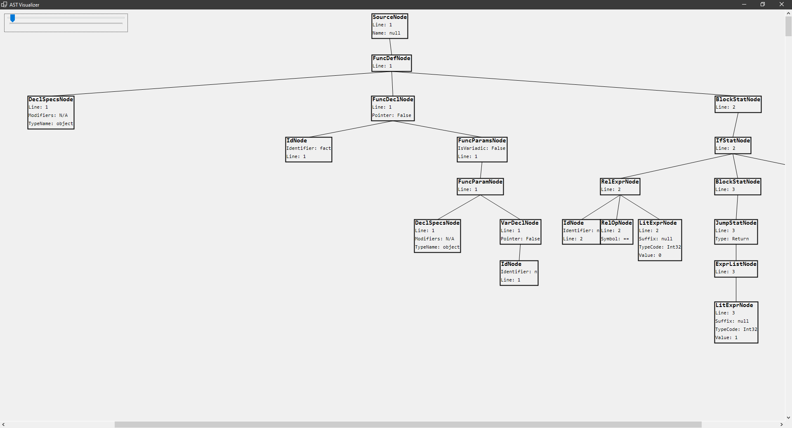
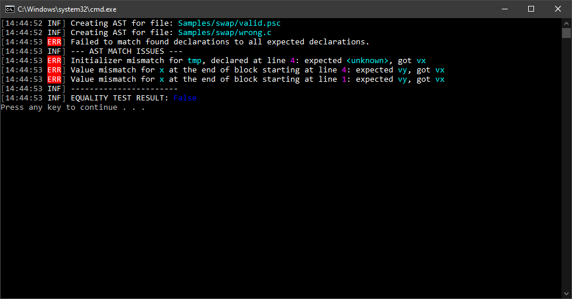
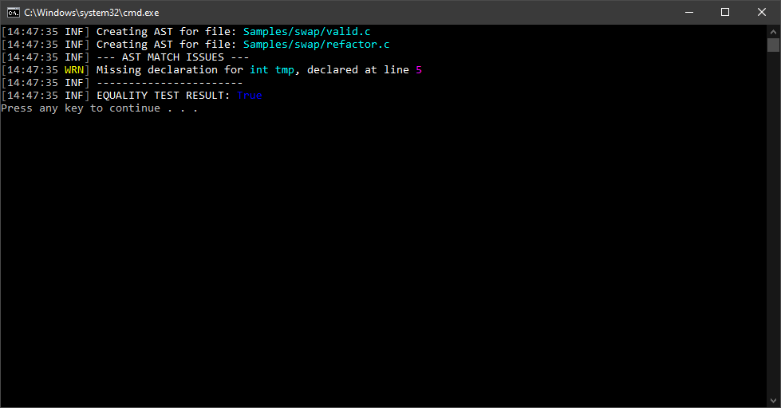

# LICC - Language Invariant Code Comparer

[](https://github.com/ivan-ristovic/LICC/issues)
[](https://github.com/ivan-ristovic/LICC/releases)
[](https://github.com/ivan-ristovic/LICC/releases)

LICC is a set of libraries which provide common AST abstraction API. Furthermore, as an example of use, a library for semantic comparison of structurally similar imperative code segments has been included in this solution.

LICC solution is organized in several namespaces:
- `LICC` - Driver program
- `LICC.AST` - Common AST library
    - `LICC.AST.Builders` - AST builder interface and implementation
    - `LICC.AST.Nodes` - AST node classes
    - `LICC.AST.Visitors` - AST visitor classes
- `LICC.Core` - Semantic AST comparison library
    - `LICC.Core.Comparers` - Comparer classes for AST node types
    - `LICC.Core.Issues` - Match issues types returned by comparer
- `LICC.Visualizer` - GUI application to visualize generated AST
- `LICC.Tests` - Unit and integration tests

## Motivation and project description
There are many programming languages out there and, even though their syntax might be different, they often derive from or use certain universal programming concepts. We also call that a _way of writing code_ or, more commonly, a _programming paradigm_. The motivation for LICC came from the inability to find a shared API for every programming language that is a part of a procedural paradigm. LICC aims to create a common abstraction for imperative (but also procedural, OO, script and, through a few concepts, functional) programming paradigm so that it is possible to view many different programming languages on the same level of abstraction.

LICC was made as a proof of concept for my MSc thesis (_Semantic comparison of structurally similar imperative code segments_) but has grown with aim to become fully operational and manageable long-term. LICC can be used as a tool to generate serialized AST in JSON, visualize generated AST, or compare generated ASTs. Since LICC does not rely on any language-specific AST node types, it can compare codes written in different programming languages (hence, _Language Invariant_). LICC provides intuitive API for traversing generated AST and provides visitors for common AST operations. AST comparer is also provided via intuitive API and, although limited, the comparer module can be extended and upgraded with ease.

LICC can theoretically work with any programming language as long as the adapter for that language is written. Adapters (or, in further text, _Builders_) serve as an intermediary between parse trees and common ASTs. Builders are used to generate AST from a parse tree and they are implemented differently for every programming language due to native differences in parse trees. For now, builders are written for the following languages:
- C
- Lua
- Pseudocode-like PoC language

Interested readers can read more in my  (currently only in Serbian).

## Used libraries/tools
- [ANTLR4](https://www.antlr.org/)
- [MathNET.Symbolics](https://symbolics.mathdotnet.com/)

## Examples

### Creating common AST

Source codes which show supported syntax constructs in one place for various programming languages can be found in the  directory. Several examples will be shown below.

```sh
$ ./LICC ast 
ERROR(S):
  A required value not bound to option name is missing.

  -v, --verbose    (Default: false) Verbose output

  -t, --tree       (Default: false) Show AST

  -o, --output     Output path

  -c, --compact    (Default: false) Compact AST output

  --help           Display this help screen.

  --version        Display version information.

  value pos. 0     Required. Source path
```

#### AST created for C source:
```c
int gl_y = 2;
void f(int x);
int gl_x = 3;

int main()
{
	int x = 1;
	//printf("Hello world!% d\n", x);
	return 0;
}

static int gl_z;
```
```sh
$ ./LICC ast -v sample.c 
```

<details>
<summary>Click to expand!</summary>

```json
{
  "Name": null,
  "NodeType": "SourceNode",
  "Line": 1,
  "Children": [
    {
      "NodeType": "DeclStatNode",
      "Line": 1,
      "Children": [
        {
          "Modifiers": {
            "AccessModifiers": "Unspecified",
            "QualifierFlags": "None"
          },
          "TypeName": "int",
          "NodeType": "DeclSpecsNode",
          "Line": 1,
          "Children": []
        },
        {
          "NodeType": "DeclListNode",
          "Line": 1,
          "Children": [
            {
              "Pointer": false,
              "NodeType": "VarDeclNode",
              "Line": 1,
              "Children": [
                {
                  "Identifier": "gl_y",
                  "NodeType": "IdNode",
                  "Line": 1,
                  "Children": []
                },
                {
                  "Value": 2,
                  "Suffix": null,
                  "TypeCode": "Int32",
                  "NodeType": "LitExprNode",
                  "Line": 1,
                  "Children": []
                }
              ]
            }
          ]
        }
      ]
    },
    {
      "NodeType": "DeclStatNode",
      "Line": 3,
      "Children": [
        {
          "Modifiers": {
            "AccessModifiers": "Unspecified",
            "QualifierFlags": "None"
          },
          "TypeName": "void",
          "NodeType": "DeclSpecsNode",
          "Line": 3,
          "Children": []
        },
        {
          "NodeType": "DeclListNode",
          "Line": 3,
          "Children": [
            {
              "Pointer": false,
              "NodeType": "FuncDeclNode",
              "Line": 3,
              "Children": [
                {
                  "Identifier": "f",
                  "NodeType": "IdNode",
                  "Line": 3,
                  "Children": []
                },
                {
                  "IsVariadic": false,
                  "NodeType": "FuncParamsNode",
                  "Line": 3,
                  "Children": [
                    {
                      "NodeType": "FuncParamNode",
                      "Line": 3,
                      "Children": [
                        {
                          "Modifiers": {
                            "AccessModifiers": "Unspecified",
                            "QualifierFlags": "None"
                          },
                          "TypeName": "int",
                          "NodeType": "DeclSpecsNode",
                          "Line": 3,
                          "Children": []
                        },
                        {
                          "Pointer": false,
                          "NodeType": "VarDeclNode",
                          "Line": 3,
                          "Children": [
                            {
                              "Identifier": "x",
                              "NodeType": "IdNode",
                              "Line": 3,
                              "Children": []
                            }
                          ]
                        }
                      ]
                    }
                  ]
                }
              ]
            }
          ]
        }
      ]
    },
    {
      "NodeType": "DeclStatNode",
      "Line": 5,
      "Children": [
        {
          "Modifiers": {
            "AccessModifiers": "Unspecified",
            "QualifierFlags": "None"
          },
          "TypeName": "int",
          "NodeType": "DeclSpecsNode",
          "Line": 5,
          "Children": []
        },
        {
          "NodeType": "DeclListNode",
          "Line": 5,
          "Children": [
            {
              "Pointer": false,
              "NodeType": "VarDeclNode",
              "Line": 5,
              "Children": [
                {
                  "Identifier": "gl_x",
                  "NodeType": "IdNode",
                  "Line": 5,
                  "Children": []
                },
                {
                  "Value": 3,
                  "Suffix": null,
                  "TypeCode": "Int32",
                  "NodeType": "LitExprNode",
                  "Line": 5,
                  "Children": []
                }
              ]
            }
          ]
        }
      ]
    },
    {
      "NodeType": "FuncDefNode",
      "Line": 8,
      "Children": [
        {
          "Modifiers": {
            "AccessModifiers": "Unspecified",
            "QualifierFlags": "None"
          },
          "TypeName": "int",
          "NodeType": "DeclSpecsNode",
          "Line": 8,
          "Children": []
        },
        {
          "Pointer": false,
          "NodeType": "FuncDeclNode",
          "Line": 8,
          "Children": [
            {
              "Identifier": "main",
              "NodeType": "IdNode",
              "Line": 8,
              "Children": []
            }
          ]
        },
        {
          "NodeType": "BlockStatNode",
          "Line": 10,
          "Children": [
            {
              "NodeType": "DeclStatNode",
              "Line": 10,
              "Children": [
                {
                  "Modifiers": {
                    "AccessModifiers": "Unspecified",
                    "QualifierFlags": "None"
                  },
                  "TypeName": "int",
                  "NodeType": "DeclSpecsNode",
                  "Line": 10,
                  "Children": []
                },
                {
                  "NodeType": "DeclListNode",
                  "Line": 10,
                  "Children": [
                    {
                      "Pointer": false,
                      "NodeType": "VarDeclNode",
                      "Line": 10,
                      "Children": [
                        {
                          "Identifier": "x",
                          "NodeType": "IdNode",
                          "Line": 10,
                          "Children": []
                        },
                        {
                          "Value": 1,
                          "Suffix": null,
                          "TypeCode": "Int32",
                          "NodeType": "LitExprNode",
                          "Line": 10,
                          "Children": []
                        }
                      ]
                    }
                  ]
                }
              ]
            },
            {
              "Type": "Return",
              "NodeType": "JumpStatNode",
              "Line": 12,
              "Children": [
                {
                  "Value": 0,
                  "Suffix": null,
                  "TypeCode": "Int32",
                  "NodeType": "LitExprNode",
                  "Line": 12,
                  "Children": []
                }
              ]
            }
          ]
        }
      ]
    },
    {
      "NodeType": "DeclStatNode",
      "Line": 15,
      "Children": [
        {
          "Modifiers": {
            "AccessModifiers": "Unspecified",
            "QualifierFlags": "Static"
          },
          "TypeName": "int",
          "NodeType": "DeclSpecsNode",
          "Line": 15,
          "Children": []
        },
        {
          "NodeType": "DeclListNode",
          "Line": 15,
          "Children": [
            {
              "Pointer": false,
              "NodeType": "VarDeclNode",
              "Line": 15,
              "Children": [
                {
                  "Identifier": "gl_z",
                  "NodeType": "IdNode",
                  "Line": 15,
                  "Children": []
                }
              ]
            }
          ]
        }
      ]
    }
  ]
}
```
</details>


#### AST created for Lua source:
```lua
function fact (n)
  if n == 0 then
    return 1
  else
    return n * fact(n-1)
  end
end
```
```sh
$ ./LICC ast -vc sample.lua --tree
```

<details>
<summary>Click to expand!</summary>

```json
{"Name":null,"NodeType":"SourceNode","Line":1,"Children":[{"NodeType":"FuncDefNode","Line":1,"Children":[{"Modifiers":{"AccessModifiers":"Unspecified","QualifierFlags":"None"},"TypeName":"object","NodeType":"DeclSpecsNode","Line":1,"Children":[]},{"Pointer":false,"NodeType":"FuncDeclNode","Line":1,"Children":[{"Identifier":"fact","NodeType":"IdNode","Line":1,"Children":[]},{"IsVariadic":false,"NodeType":"FuncParamsNode","Line":1,"Children":[{"NodeType":"FuncParamNode","Line":1,"Children":[{"Modifiers":{"AccessModifiers":"Unspecified","QualifierFlags":"None"},"TypeName":"object","NodeType":"DeclSpecsNode","Line":1,"Children":[]},{"Pointer":false,"NodeType":"VarDeclNode","Line":1,"Children":[{"Identifier":"n","NodeType":"IdNode","Line":1,"Children":[]}]}]}]}]},{"NodeType":"BlockStatNode","Line":2,"Children":[{"NodeType":"IfStatNode","Line":2,"Children":[{"NodeType":"RelExprNode","Line":2,"Children":[{"Identifier":"n","NodeType":"IdNode","Line":2,"Children":[]},{"Symbol":"==","NodeType":"RelOpNode","Line":2,"Children":[]},{"Value":0,"Suffix":null,"TypeCode":"Int32","NodeType":"LitExprNode","Line":2,"Children":[]}]},{"NodeType":"BlockStatNode","Line":3,"Children":[{"Type":"Return","NodeType":"JumpStatNode","Line":3,"Children":[{"NodeType":"ExprListNode","Line":3,"Children":[{"Value":1,"Suffix":null,"TypeCode":"Int32","NodeType":"LitExprNode","Line":3,"Children":[]}]}]}]},{"NodeType":"BlockStatNode","Line":5,"Children":[{"Type":"Return","NodeType":"JumpStatNode","Line":5,"Children":[{"NodeType":"ExprListNode","Line":5,"Children":[{"NodeType":"ArithmExprNode","Line":5,"Children":[{"Identifier":"n","NodeType":"IdNode","Line":5,"Children":[]},{"Symbol":"*","NodeType":"ArithmOpNode","Line":5,"Children":[]},{"NodeType":"FuncCallExprNode","Line":5,"Children":[{"Identifier":"fact","NodeType":"IdNode","Line":5,"Children":[]},{"NodeType":"ExprListNode","Line":5,"Children":[{"NodeType":"ArithmExprNode","Line":5,"Children":[{"Identifier":"n","NodeType":"IdNode","Line":5,"Children":[]},{"Symbol":"-","NodeType":"ArithmOpNode","Line":5,"Children":[]},{"Value":1,"Suffix":null,"TypeCode":"Int32","NodeType":"LitExprNode","Line":5,"Children":[]}]}]}]}]}]}]}]}]}]}]}]}
```


</details>


## Comparing common ASTs

Several examples can be found in the  directory. One sample will be shown below.

```sh 
$ ./LICC cmp
ERROR(S):
  A required value not bound to option name is missing.

  -v, --verbose    Set output to verbose messages.

  --help           Display this help screen.

  --version        Display version information.

  value pos. 0     Required. Specification path.

  value pos. 1     Required. Test source path.
```

### Example for swap sources

Sources:  

```sh
$ ./LICC cmp Samples/swap/valid.c Samples/swap/wrong.c
```


Sources:  

```sh
$ ./LICC cmp Samples/swap/valid.psc Samples/swap/wrong.c
```




Sources:  

```sh
$ ./LICC cmp Samples/swap/valid.c Samples/swap/refactor.c
```




# Extending AST library with new builders

Steps:
- Create (or use ) ANTLR4 grammar files
- Create lexer and parser for your grammar via ANTLR4 (using `-Dlanguage=CSharp` option)
- Create a builder namespace in `LICC.AST.Builder.<YOUR_GRAMMAR>` as per examples already present for C or Lua
- Create a Builder type extending `ANTLR_GENERATED_BASE_VISITOR<ASTNode>` and implementing `IASTBuilder<ANTLR_GENERATED_PARSER_TYPE>` (change uppercase areas appropriately)
- Apply `[ASTBuilder(".YOUR_FILE_EXTENSION")]` attribute to the class in order for it to be automatically used when loading sources of that extension

Check out the Pseudocode PoC language  and  as an example.


# Extending Core library with new comparers

Steps:
- Create new comparer class in the `LICC.Core.Comparers` namespace
- Extend `ASTNodeComparerBase<T>` base class where `T` is the type of `ASTNode` you wish to compare

Comparers created in this way will be automatically picked up by `ASTNodeComparer` class via reflection.

Comparers can (and it is encouraged for them to) use already existing comparers in their logic. Check out some of the already written  as an example.